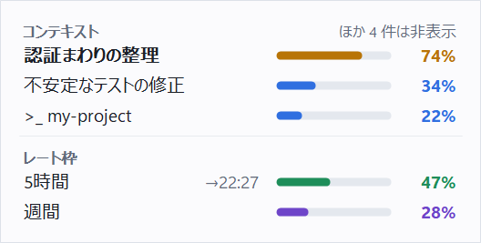

# ctxtray

Windows で Claude Code のコンテキスト残量とレート枠を常時表示する常駐ツール。

[English README](README.md)

Claude Desktop はコンテキスト使用量とレートリミットを表示してくれますが、
インジケーターにカーソルを合わせてクリックしないと見えません。そこで思考が途切れます。
ctxtray は同じ数字を常に画面に出しておきます。小さな最前面パネルと、
通知領域アイコンに描いたバーの 2 つです。

<picture>
  <source media="(prefers-color-scheme: dark)" srcset="docs/images/ctxtray-hud-ja-dark.png">
  
</picture>

<sub>架空のデータです。`ctxtray --hud-preview` で作成しています。</sub>

> **非公式ツールです。** Anthropic とは無関係で、同社の承認や支援を受けていません。
> Claude は Anthropic, PBC の商標です。

## できること

- **セッションごとのコンテキスト使用量** — Claude Desktop で開いている Code タブのすべて。
  しばらく使っていないセッション（既定は 24 時間）は隠します。
- **5時間枠と週間枠**、および 5時間枠のリセット時刻。
- 閾値を超えたときの**通知**。

ターミナルや VS Code から起動した Claude Code のセッションも、Claude Code が
「実行中のプロセス」として登録していれば `>_` の印を付けて表示します。
**ただし、この経路はまだ確認できていません**（開発に使った PC では Claude Code を
Claude Desktop の中でしか使っていないため）。試験的な機能として扱ってください。

裏付けのある数字だけを出します。検証できていない推測（圧縮までの残りターン、
週間枠のリセット曜日）は、あえて表示していません。

## 導入

1. [Releases](../../releases) から `ctxtray-<版>-win-x64.zip` をダウンロードして展開します。
2. `ctxtray.exe` を、置き場所として使い続けるフォルダに移します
   （例: `%LOCALAPPDATA%\Programs\ctxtray\`）。手順 4 の自動起動はこの場所を指します。
3. 実行します。インストーラも、追加のランタイムも要りません。
4. サインインのたびに起動したい場合は、トレイアイコンを右クリックして**「ログオン時に起動」**を選びます。
   あとで `ctxtray.exe` を別の場所へ移した場合は、新しい場所から起動してください。
   自動起動が古い場所を指したままなので**「ログオン時に起動」**のチェックが外れて見えます。もう一度オンにすれば直ります。

動作条件: Windows 10 バージョン 1903 以降、または Windows 11。
（.NET Framework 4.8 はこれらの OS に標準で入っています）

配布物にコード署名をしていないため、初回実行時に SmartScreen の警告が出ます。
**［詳細情報］→［実行］**で進めてください。ダウンロードしたファイルは、
Release ページにある `.sha256` ファイルと照合できます。
ビルド済みバイナリを信用したくない場合は[自分でビルド](#ビルド)できます。

## 使い方

| | |
|---|---|
| `Ctrl+Alt+C` | パネルの表示 / 非表示（変更可） |
| ドラッグ | パネルを移動 |
| トレイアイコンをダブルクリック | パネルの表示 / 非表示 |
| トレイアイコンを右クリック | パネルの表示・ログオン時に起動・設定・今すぐ更新・設定ファイルを開く・稼働状況・終了 |

セッション名が灰色のときは、その Claude Code のプロセスがいま動いていないことを表します
（しばらく使っていないタブなど）。灰色のセッションは、トレイアイコンと通知の対象にしません。
再び動き出すまで、使用量が増えないためです。

### 通知領域アイコン

アイコンは量を数字ではなくバーで示します。正確な値はアイコンにマウスを乗せると出ます。
値ごとに色が決まっていて（コンテキスト=青 / 5時間枠=緑 / 週間枠=紫）、
閾値を超えた値だけが黄、さらに赤に変わります。パネルも同じ色で、値の並びも
コンテキスト・5時間枠・週間枠の順に揃えています。出し方は 2 通りあり、設定で切り替えられます。

- **1 個にまとめる**（既定）— 値 1 つにつき横のバー 1 本。上からコンテキスト・5時間枠・週間枠の順です。
- **値ごとに分ける** — 値ごとに別のアイコンにし、バーの上に何の値かを示す目印を描きます。
  目印は英字（`C`・`5h`・`W`）か絵記号（吹き出し・時計・カレンダー）から選べます。
  左からコンテキスト・5時間枠・週間枠の順に並ぶように追加します。
  「隠れているインジケーター」に入った場合は、1 回だけタスクバーへドラッグしてください。

どの値を出すかは設定で選べ、その選択は両方の出し方に共通です。

アイコンにコンテキストを出す場合は、**動いているセッションのうち最も圧縮に近いもの**を選びます。
基準は % ではなく「そのモデルの圧縮点にどれだけ近いか」です。
モデルによってコンテキストウィンドウが違うため、% が大きい方が圧縮に近いとは限りません。
隠したセッションと灰色のセッションは対象にしません。動いているセッションが無いときは、
コンテキストのバーは空になります。

### レートリミットの読み方

Claude Desktop は 5〜15 分ごとに、しかも**アプリを使っている間だけ**使用量を記録します。
そのため作業中は、表示値が実際の使用量より遅れることがあります。
実測で最大 2.8 %/分 の速さで増えるため、7 分前の値は 5時間枠を 20 ポイントほど
低く見せている可能性があります。`ctxtray --json` では `"freshness": "behind"` として確認できます。

**灰色表示は「参考値」です。** Claude Desktop が起動していないか、
24 時間以上記録が更新されていません。

### リセット時刻

5時間枠のリセットは記録の履歴から推定します。記録は 5〜15 分おきなので、
推定は最大でその間隔ぶん早めにずれることがあります。
実際のリセットと照合したときの差は 1 分でした。

週間枠のリセット時刻は**どのファイルにも記録されていません**。
履歴から曜日までは絞り込めますが（過程は `ctxtray --verify-weekly` で見られます）、
信用できる精度ではないため、パネルやツールチップには出していません。

## 設定

トレイメニューの**「設定…」**で、4 つのタブ（HUD／トレイアイコン／しきい値と通知／全般）の
設定画面が開きます。内容は `%LOCALAPPDATA%\ctxtray\config.json` に保存されます。
このファイルを直接編集しても、**保存すると即座に反映**されます。再起動は要りません。
実行中に設定ファイルが読めなくなったときは、直すまで直前の設定のまま動きます。

下の例のようにコメント（`//` と `/* */`）を書いても読めますが、コメントは残りません。
設定画面で OK を押したときや、パネルを動かしたときに、ctxtray がファイルを書き直すためです。

閾値の定義は**1 か所だけ**です。パネルの行の色、トレイアイコンの色、通知は
すべて同じ値から決まります。表示用と通知用に別々の数字を持つことはありません。

```jsonc
{
  "thresholds": {
    // コンテキストだけは「圧縮点までの到達率」で持ちます。
    // 圧縮点は変えられる値なので、「85% で赤」と絶対値で固定すると、
    // 圧縮点を 80% に下げたときに「圧縮された後に赤くなる」からです。
    "context":  { "warn": 0.75, "danger": 0.90 },
    "fiveHour": { "warn": 80,   "danger": 95 },
    "weekly":   { "warn": 80,   "danger": 95 }
  },
  "notify": {
    "enabled": { "context": true, "fiveHour": true, "weekly": true },
    // 通知したあと、値が閾値からこのポイント数だけ下がるまでは、
    // もう一度閾値を超えても通知しません。
    "hysteresisPts": 10,
    // 同じ値の通知の最短間隔（分）。前回の通知より上のレベル（注意 → 危険）に
    // 上がったときは、待たずに通知します。
    "minRepeatMinutes": 30
  },
  "tray": {
    "mode": "single",            // "single" = 1 個にまとめる / "multi" = 値ごとに分ける
    "label": "letters",          // multi のときの目印: "letters"（英字） | "glyphs"（絵記号）
    "values": ["context", "fiveHour", "weekly"]
  },
  "display": {
    "theme": "auto",             // "light" | "dark"
    "textSize": "normal",        // "small" | "large" | "xlarge"
    "hudWidth": 352,             // 標準の文字サイズでのパネルの幅
    "showRateLimits": true,
    "showSessions": true,
    "hideIdleSessions": true,
    "idleHours": 24,
    "showBar": true,
    "showTokens": false,         // 例: 284k/1M
    "showResets": "auto",        // "always" | "auto" | "never"（5時間枠のリセット時刻）
    "opacity": 0.9,
    "clickThrough": false,
    "showAtStartup": true
  },
  "language": "auto",            // "ja" | "en"
  // 自動圧縮が起きる点（コンテキストウィンドウに対する割合）。
  // 0.967 は Claude Code の既定値です。/autocompact で変えた場合は合わせてください。
  "compactThreshold": 0.967,
  // ctxtray がまだ知らないモデルのコンテキストウィンドウ（トークン数）。
  // ここに書いた値は、組み込みの表より優先されます。
  "modelLimits": { "claude-example-6": 1000000 }
}
```

既定の `showResets: "auto"` は、5時間枠のリセットが残り 30 分になったときだけ時刻を出します。
常時出すと、残りの 4 時間半はただの雑音になるためです。

## コマンドライン

```
ctxtray                     常駐（トレイ + パネル）
ctxtray --status            現在の状態を表形式で 1 回表示
ctxtray --json              現在の状態を JSON で出力
ctxtray --no-external       Desktop のタブだけを対象にする
ctxtray --include-archived  終了済みタブも含める
ctxtray --verify-weekly     週間枠リセット推定の過程を表示
ctxtray --icon-preview DIR  トレイアイコン全スタイルの見本 PNG を DIR に出力
ctxtray --hud-preview DIR   パネルの見本 PNG（架空のデータ）を DIR に出力
```

`--status` と `--json` は、パネルで隠しているものも含めて全セッションを出します。

`ctxtray.exe` は GUI のプログラムなので、シェルは終了を待たず、`>` によるリダイレクトでは
出力を受け取れません。スクリプトから使うときは**パイプで受けてください**（PowerShell）。

```powershell
ctxtray --json | ConvertFrom-Json
ctxtray --json | Out-File state.json
```

パイプやファイルに出すときは、JSON の中の日本語などを `\uXXXX` の形で書きます。
受け取る側がどの文字コードで読んでも壊れないようにするためです。

## 何を読み、何を書き、何をしないか

読むのはすべて **Claude Desktop / Claude Code 自身が書いた平文ファイル**で、
読み取り専用で開きます。詳細は [docs/how-it-works.md](docs/how-it-works.md)（英語）にあります。

| 読むもの | 用途 |
|---|---|
| `plan-usage-history.json` | 5時間枠・週間枠の % |
| `claude-code-sessions/**/local_*.json` | 開いているタブ、そのモデルと作業フォルダ |
| `~/.claude/projects/**/*.jsonl` | `usage` フィールドのトークン数 |
| `~/.claude/sessions/<pid>.json` | 実際に走っている Claude Code プロセス |

書き込むのは自分のファイルだけです。

- `%LOCALAPPDATA%\ctxtray\config.json` — 設定（読めないファイルを退避したときは `config.json.bak` も）
- スタートアップフォルダの `ctxtray.lnk` — **「ログオン時に起動」をオンにしている間だけ**

**ctxtray がやらないこと:**

- Claude Desktop の改変（`app.asar` の書き換え・再パック、preload スクリプトの注入、
  Electron fuse の変更）
- Claude Desktop のコードの逆コンパイル・解析
- Anthropic の API へのアクセス（公開・非公開を問わず）
- 保存された OAuth トークンやセッション Cookie の読み取り・復号・利用
- 会話本文の読み取り（読むのはトークン数・時刻・モデル名だけです）
- ネットワーク通信（更新チェックも含めて一切行いません）
- `~/.claude/settings.json` への書き込み（hooks も statusLine も使いません）

## アンインストール

1. トレイアイコンを右クリックして**「ログオン時に起動」**をオフにします
   （または、`shell:startup` で開くフォルダから `ctxtray.lnk` を削除します）。
2. トレイアイコンを右クリック →**「終了」**。
3. `ctxtray.exe` を削除します。
4. `%LOCALAPPDATA%\ctxtray` フォルダを削除します。

## 制限

- **依存しているファイル形式は Claude の内部仕様です。** 更新で変わりえます。
  そのときは例外で落ちたり推測で埋めたりせず「不明」表示に落ちますが、修正が要る場合があります。
- **コンテキストは 1 ターン遅れます。** トークン数は応答が終わった時点で書き込まれるためです。
- **圧縮点は Claude Code の公式ドキュメントにある既定値（0.967）です。**
  コンテキストウィンドウが 1M のモデルは、約 967K トークンで自動圧縮されます
  （[Claude Code のドキュメント](https://code.claude.com/docs/en/model-config#default-auto-compact-thresholds)）。
  そのため、ウィンドウの上限で初めて圧縮するモデル（200K のモデルなど）では、少し早めに 100% になります。
  `/autocompact` で圧縮点を変えた場合は、`compactThreshold` を合わせてください
  （ctxtray は Claude Code の設定を読みません）。コンテキストの色と通知はこの値に依存します。
- **分母が分からないモデルは % を出しません。** 誤った分母で % を出すより、
  何も出さない方が安全だからです。`modelLimits` に足せば表示されます。
- **ターミナルと VS Code のセッションは未確認です**（[できること](#できること)を参照）。
- 通知はバルーン通知なので、アクションセンターには残らず、
  集中モード（フォーカスアシスト）中は表示されません。

## ビルド

`net48` をターゲットにできる .NET SDK が要ります
（参照アセンブリは最初のビルドで NuGet から自動で入ります）。

```
dotnet build src/CtxTray/CtxTray.csproj -c Release
```

出力: `src/CtxTray/bin/Release/ctxtray.exe`。
この exe は単体で動きます。同じフォルダの他のファイルをコピーする必要はありません。

読み取りと通知の判定を確かめる試験は `tests/CtxTray.Tests` にあります
（テスト用の枠組みを使わない普通のコンソールプログラムです）。
結果を表示し、失敗があれば終了コード 1 を返します。

```
dotnet build tests/CtxTray.Tests/CtxTray.Tests.csproj -c Release
tests/CtxTray.Tests/bin/Release/ctxtray-tests.exe
```

## ライセンス

MIT — [LICENSE](LICENSE) を参照してください。
