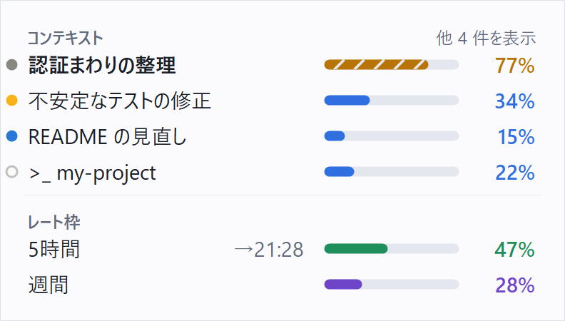

# ctxtray

Claude Code のコンテキスト残量とレート枠を、Windows の画面に常に表示しておく常駐ツールです。

[English README](README.md)

Claude Desktop でもコンテキストの使用量とレート枠は確認できますが、
インジケーターをクリックしないと表示されず、そのたびに作業の手が止まります。
ctxtray は同じ数値を、常に最前面にある小さなパネルと、通知領域のアイコンに表示し続けます。

<picture>
  <source media="(prefers-color-scheme: dark)" srcset="docs/images/ctxtray-hud-ja-dark.png">
  
</picture>

<sub>画像は架空のデータです（`ctxtray --hud-preview` で作成）。</sub>

> **非公式のツールです。** Anthropic とは関係がなく、同社の承認や支援も受けていません。
> Claude は Anthropic, PBC の商標です。

## できること

- **セッションごとのコンテキスト使用量** — Claude Desktop で開いているすべての Code タブが対象です。
  一定時間（既定は 24 時間）使っていないセッションは表示しません。
- **5時間枠と週間枠**の使用率と、5時間枠のリセット時刻
- しきい値を超えたときの**通知**

ターミナルや VS Code で起動した Claude Code のセッションも、プロセスが実行されている間は
`>_` の印を付けて表示します。プロセスが終了すると行は消えます（Claude Desktop のタブは灰色で残ります）。
まだ一度もメッセージを送っていない会話は表示しません。
これらのセッション名は Claude Code がプロセスに付けたもので、再起動や再開のたびに変わることがあります。
Claude Desktop と VS Code の両方で開いている会話は、Claude Desktop のタブとして 1 行にまとめます。

表示するのは、裏付けのある数値だけです。圧縮までの残りターン数や週間枠のリセット曜日のように、
検証できない推測値はあえて表示していません。

## インストール

1. [Releases](../../releases) から `ctxtray-<バージョン>-win-x64.zip` をダウンロードし、展開します。
2. `ctxtray.exe` を、今後も置いておくフォルダーに移動します
   （例: `%LOCALAPPDATA%\Programs\ctxtray\`）。手順 4 の自動起動はこの場所を参照します。
3. `ctxtray.exe` を実行します。インストーラーや追加のランタイムは必要ありません。
4. サインインのたびに自動で起動するには、トレイアイコンを右クリックして**「サインイン時に起動」**を選びます
   （設定の**「全般」**タブにある**「Windows へのサインイン時に ctxtray を起動する」**でも同じです）。
   あとで `ctxtray.exe` を別の場所に移動した場合は、新しい場所から一度起動してください。
   自動起動が古い場所を指したままになるため、**「サインイン時に起動」**のチェックが外れた状態で表示されます。
   もう一度オンにすると直ります。

動作環境: Windows 10 バージョン 1903 以降、または Windows 11
（必要な .NET Framework 4.8 は、これらの OS に標準で含まれています）

配布ファイルにはコード署名をしていないため、初回の実行時に SmartScreen の警告が表示されます。
**［詳細情報］→［実行］**の順にクリックして進めてください。ダウンロードしたファイルは、
Release ページにある `.sha256` ファイルで改ざんがないか確認できます。
ビルド済みのファイルを使いたくない場合は、[自分でビルド](#ビルド)することもできます。

ctxtray は更新を確認しません（既定ではネットワーク通信を一切行いません。[詳しくは後述](#何を読み何を書き何をしないか)）。
そのため、新しいバージョンが出ても ctxtray からはお知らせできません。
このリポジトリ上部の **Watch → Custom → Releases** をオンにすると、GitHub から通知が届きます。

## 使い方

| 操作 | 動作 |
|---|---|
| `Ctrl+Alt+C` | パネルの表示／非表示（キーは変更でき、なしにもできます） |
| 自分で決めたキー | クリックの透過のオン／オフ（既定はなし。設定で決めます） |
| ドラッグ | パネルを移動 |
| 行にマウスを合わせる | 詳細を表示（名前の全文、モデルとエフォート、トークン数、自動圧縮までの残り、値が記録された時刻） |
| トレイアイコンをクリック | パネルの表示／非表示 |
| トレイアイコンまたはパネルを右クリック | メニューを表示（パネルの表示、クリックを透過、サインイン時に起動、設定、今すぐ更新、設定ファイルを開く、ctxtray について、終了） |

キーを変更するには、設定の**「パネル」**タブでキーの欄をクリックし、Ctrl/Alt/Shift のいずれかと一緒にキーを押します。
Delete キーを押すと「なし」になります。キーを押しても欄が変わらない場合は、そのキーを他のアプリがすでに使っています。

**「クリックを透過」**をオンにすると、パネルはマウス操作を一切受け付けなくなります。
パネルの後ろにあるウィンドウをクリックできるようになる代わりに、パネルの移動、行の詳細の表示、右クリックはできなくなります。
オフに戻すには、トレイアイコンの右クリックメニューを使うか、クリックの透過にキーを割り当てていればそのキーを押します。
オンにしたときは、戻し方がパネルに数秒間表示されます。

セッション名が灰色の行は、その Claude Code のプロセスが実行されていないことを示します
（しばらく使っていないタブなど）。灰色のセッションは、再び実行されるまで使用量が増えないため、
トレイアイコンと通知の対象から外しています。設定で、灰色の行を非表示にすることもできます。

見出しの右にある**「ほか N 件を表示」**をクリックすると、非表示にしている行をその場で表示できます
（もう一度クリックすると元に戻ります）。設定は変わらず、トレイアイコンと通知の対象も変わりません。
レート枠の見出しに**「参考値」**と表示されているときは、Claude Desktop が起動していないため、
最後に記録された値を表示しています。

パネルでは、注意と危険の値を、色に加えてバーの**斜めの縞模様**でも示します（注意は粗い縞、危険は細かい縞）。
色の違いだけに頼らないための表示で、設定でオフにできます。
通知領域のアイコンは小さく、縞模様を見分けられないため、色だけで示します。

パネルは常に画面内に収まるように表示されます。画面の下半分に置いた場合は、セッションが増えると上に向かって伸びます。
動画、プレゼンテーション、ゲームなどを全画面表示している間はパネルを非表示にし、終わると再び表示します
（Claude Desktop が前面にあるときは非表示にしません）。どちらの動作も設定で切り替えられます。

### 通知領域アイコン

アイコンには、使用量をバーで表示します。正確な値は、アイコンにマウスを合わせると表示されます。
値ごとに色が決まっていて（コンテキストは青、5時間枠は緑、週間枠は紫）、
しきい値を超えると黄色、さらに超えると赤に変わります。パネルも同じ色を使い、
値の並び順もコンテキスト、5時間枠、週間枠でそろえています。表示方法は次の 2 種類で、設定で切り替えられます。

- **1 個にまとめる**（既定）— 1 つのアイコンに、値ごとに横棒を 1 本ずつ表示します。
  上からコンテキスト、5時間枠、週間枠の順です。
- **値ごとに分ける** — 値ごとに別のアイコンにし、バーの上に何の値かを示すラベルを表示します。
  ラベルは文字（`C`・`5h`・`W`）か記号（吹き出し・時計・カレンダー）から選べます。
  ラベルの代わりに現在の %（パネルと同じ数値）を表示することもできます。この場合は、並び順と色で値を見分けます。
  アイコンは左からコンテキスト、5時間枠、週間枠の順になるように追加されます。
  「隠れているインジケーター」（^）に入ってしまった場合は、一度だけタスクバーへドラッグしてください。

表示する値は設定で選べます。選んだ値は、どちらの表示方法でも共通です。

アイコンに表示するコンテキストは、**実行中のセッションのうち % が最も大きいもの**です。
% はモデルのコンテキストウィンドウに対する割合で、自動圧縮はどのモデルでも同じ割合で起きるため、
% が最も大きいセッションが、最も自動圧縮に近いセッションです。
非表示のセッションと灰色のセッションは対象にしません。実行中のセッションがないときは、
コンテキストのバーは空になります。

### レート枠の読み方

Claude Desktop が使用量を記録するのは 5〜15 分ごとで、しかも**アプリを使っている間だけ**です。
そのため作業中は、表示される値が実際の使用量より遅れることがあります。
実測では最大で毎分 2.8 ポイントの速さで増えたため、7 分前の値だと、5時間枠を 20 ポイントほど
低く表示している可能性があります。この状態は `ctxtray --json` の `"freshness": "behind"` で確認できます。

**灰色の値は「参考値」です。** Claude Desktop が起動していないか、24 時間以上記録が更新されていない状態です。
レート枠を記録しているのは Claude Desktop だけです。そのため、Claude Desktop を閉じてターミナルや VS Code で
Claude Code を使っている間は、Claude Desktop が最後に記録した値が灰色で表示されたままになります
（これらのセッションのコンテキストは更新されます）。

### リセット時刻

5時間枠のリセット時刻は、記録の履歴から推定しています。記録は 5〜15 分おきのため、
推定値は最大でその間隔の分だけ早めにずれることがあります。
実際のリセットと照らし合わせたときの差は 1 分でした。

週間枠のリセット時刻は、**どのファイルにも記録されていません**。
履歴から曜日までは絞り込めますが（推定の過程は `ctxtray --verify-weekly` で確認できます）、
信頼できる精度ではないため、パネルやツールチップには表示していません。

## 設定

トレイメニューの**「設定…」**を選ぶと、5 つのタブ（パネル／トレイアイコン／しきい値と通知／モデル／全般）がある
設定画面が開きます。設定は `%LOCALAPPDATA%\ctxtray\config.json` に保存されます。
このファイルを直接編集した場合も、**保存するとすぐに反映**され、再起動は必要ありません。
実行中に設定ファイルが読み込めなくなったときは、修正されるまで前回の設定で動作します。

下の例のようにコメント（`//` や `/* */`）を書いても読み込めますが、コメントは残りません。
設定画面で OK を押したときやパネルを移動したときに、ctxtray がファイルを書き直すためです。

しきい値の設定は**1 か所だけ**です。パネルの行の色、トレイアイコンの色、通知は、
すべて同じ値で決まります。表示用と通知用で別々の値を持つことはありません。

```jsonc
{
  "thresholds": {
    // コンテキストは 0〜1 の小数で指定します（0.75 = パネルの 75%）。
    // 自動圧縮（既定は 97%）以上の値にすると、その色になる前に自動圧縮されます。
    "context":  { "warn": 0.75, "danger": 0.90 },
    "fiveHour": { "warn": 80,   "danger": 95 },
    "weekly":   { "warn": 80,   "danger": 95 }
  },
  "notify": {
    "enabled": { "context": true, "fiveHour": true, "weekly": true },
    // 通知したあとは、値がしきい値からこのポイント数だけ下がるまで、
    // 再びしきい値を超えても通知しません。
    "hysteresisPts": 10,
    // 同じ値の通知の最小間隔（分）。前回より上のレベル（注意 → 危険）に
    // 上がったときは、待たずに通知します。
    "minRepeatMinutes": 30
  },
  "tray": {
    "mode": "single",            // "single" = 1 個にまとめる / "multi" = 値ごとに分ける
    "label": "letters",          // multi のときのラベル: "letters"（文字） | "glyphs"（記号） | "percent"（現在の %）
    "values": ["context", "fiveHour", "weekly"]
  },
  "display": {
    "theme": "auto",             // "light" | "dark"
    "textSize": "normal",        // "xsmall" | "small" | "large" | "xlarge"
    "nameWidth": 180,            // セッション名の列の幅（標準の文字サイズでの値）。パネルの幅はこれとオンにした列の合計
    "showRateLimits": true,
    "showSessions": true,
    "hideIdleSessions": true,
    "idleHours": 24,
    "hideStoppedSessions": false, // 実行中でないセッション（灰色の行）を非表示にする
    "showBar": true,
    "showTokens": false,         // 例: 284k/1M
    "showModel": false,          // 行にモデル名を表示（例: Opus 5.5）
    "showEffort": false,         // 行にエフォートを表示（例: high）
    "modelLayout": "column",     // "column"（名前の右の列。パネルの幅が広がる）| "twoLine"（名前の下。行が高くなる）
    "showResets": "auto",        // "always" | "auto" | "never"（5時間枠のリセット時刻）
    "opacity": 0.9,
    "clickThrough": false,
    "showAtStartup": true,
    "hideWhenFullscreen": true   // 全画面表示のアプリを使用中は非表示にする
  },
  "language": "auto",            // "ja" | "en"
  "clickThroughHotkey": "",      // 例: "Ctrl+Alt+T" でクリックの透過をキーで切り替える。"" = なし
  // 自動圧縮が起きる位置（コンテキストウィンドウに対する割合）。
  // 0.967 は Claude Code の既定値です。/autocompact で変更した場合は、同じ値にしてください。
  "compactThreshold": 0.967,
  // ctxtray に登録されていないモデルのコンテキストウィンドウ（トークン数）。
  // ここに書いた値は、組み込みの表より優先されます。モデル名は完全に一致させてください
  // （末尾の日付だけが違う名前、たとえば -20251001 付きは同じモデルとして扱います）。
  "modelLimits": { "claude-example-6": 1000000 },
  // 上限が不明なモデルを公式ドキュメントで調べます（既定はオフ。後述）。
  "fetchModelLimits": false
}
```

既定の `showResets: "auto"` では、5時間枠のリセットまで残り 30 分を切ったときだけ時刻を表示します。
常に表示していると、残りの 4 時間半はただの雑音になるためです。

### モデルとエフォート

各セッションのモデルとエフォートは、行にマウスを合わせたときの詳細に常に表示されます（例: `Opus 5.5 · high`）。
設定の「パネル」タブの「各行の表示項目」で**モデル**や**エフォート**をオンにすると、行にも表示できます（既定はオフ）。
表示位置は、名前の右の列か、名前の下の 2 段目（行が高くなります）から選べます。

パネルの幅は、セッション名の列の幅（「詳細設定」の「名前の幅」）と、オンにした項目（バー、トークン数、モデルの列）の
合計で決まります。どれをオンにしても名前の幅は縮まらず、その分パネルが広がります。

- 表示する値は、そのセッションの最後の応答で Claude Code が記録したものです。途中で切り替えた場合は、
  次の応答から新しい値になります
- モデル名は、公式ドキュメントで確認できた名前だけを表示します。それ以外のモデルは `claude-…` の ID のまま表示します
  （ID から名前を推測して組み立てることはしません）
- エフォートは、記録された文字列（`medium`、`high`、`xhigh` など）をそのまま表示します

### モデルの上限（コンテキストウィンドウ）

コンテキストの % の分母になるモデルの上限は、どのファイルにも書かれていないため、モデル名から決めています。
設定で指定した値 → 組み込みの表 → 公式ドキュメントから取得した値、の順に探します。
どれにも見つからないモデルは、**% の代わりに `?%` と表示**します。パネルの行にマウスを合わせると、
その理由と、% を表示するための方法が表示されます。

組み込みの表には、公式ドキュメントのモデルごとのページで確認した 14 モデルが入っています
（一覧は [docs/how-it-works.md](docs/how-it-works.md#denominators) にあります）。
新しいモデルに切り替えたときは、次のどちらかの方法で % が表示されるようになります。

- **設定の「モデル」タブで上限を選択する**（200K または 1M）。それ以外の値は `modelLimits` に書けます
- **「上限が不明なモデルを公式ドキュメントで調べる」をオンにする**（既定はオフ）。
  ctxtray に登録されていないモデルを見つけたときだけ、`platform.claude.com` の公開ドキュメントから
  そのモデルのページ（例: `…/docs/en/models/opus-5-5/overview.md`）を 1 回読み込み、
  ページに書かれたモデル ID が一致した場合にだけ上限として使います。見つからなかったモデルは 24 時間後に再確認します。
  送信するのはページの URL だけで、会話やアカウントの情報、ログイン情報は使いません

上限が不明なモデルを初めて使ったときは、通知で 1 回だけお知らせします（コンテキストの通知をオフにしている場合は表示されません）。
「モデル」タブでは、モデルごとの上限と、その取得元（組み込み、公式ドキュメント、手動設定）を確認できます。

## コマンドライン

```
ctxtray                     常駐（トレイ + パネル）
ctxtray --status            現在の状態を表形式で 1 回表示
ctxtray --json              現在の状態を JSON で出力
ctxtray --no-external       Desktop のタブだけを対象にする
ctxtray --include-archived  終了済みのタブも含める
ctxtray --verify-weekly     週間枠リセットの推定過程を表示
ctxtray --icon-preview DIR  トレイアイコンの全スタイルのプレビュー PNG を DIR に出力
ctxtray --hud-preview DIR   パネルのプレビュー PNG（架空のデータ）を DIR に出力
ctxtray --version           バージョンを表示
```

`--status` と `--json` は、パネルで非表示にしているセッションも含め、すべてのセッションを出力します。

`ctxtray.exe` は GUI アプリなので、シェルは終了を待たず、`>` でリダイレクトしても出力を受け取れません。
スクリプトから使うときは、**パイプで受け取ってください**（PowerShell の例）。

```powershell
ctxtray --json | ConvertFrom-Json
ctxtray --json | Out-File state.json
```

パイプやファイルに出力するときは、JSON 内の日本語などを `\uXXXX` の形式で書き出します。
受け取る側がどの文字コードで読み込んでも文字化けしないようにするためです。

## 何を読み、何を書き、何をしないか

読み込むのは、すべて **Claude Desktop / Claude Code 自身が書き出したテキストファイル**で、
読み取り専用で開きます。詳しくは [docs/how-it-works.md](docs/how-it-works.md)（英語）を参照してください。

| 読み込むファイル | 用途 |
|---|---|
| `plan-usage-history.json` | 5時間枠と週間枠の % |
| `claude-code-sessions/**/local_*.json` | 開いているタブと、そのモデルと作業フォルダー |
| `~/.claude/projects/**/*.jsonl` | `usage` フィールドのトークン数と、その応答のモデルとエフォート |
| `~/.claude/sessions/<pid>.json` | 実行中の Claude Code のプロセス |

このほかに、全画面表示のアプリを使っているかどうかと、前面のウィンドウがどのプログラムのものかを
Windows に問い合わせます。全画面表示のアプリの上ではパネルを非表示にし、Claude Desktop の上では非表示にしないためです。
それ以外の情報は調べません。

書き込むのは、ctxtray 自身のファイルだけです。

- `%LOCALAPPDATA%\ctxtray\config.json` — 設定（読み込めなかったファイルを退避したときは `config.json.bak` も）
- `%LOCALAPPDATA%\ctxtray\model-limits.json` — 公式ドキュメントから取得したモデルの上限と名前、
  上限が不明なモデルを通知したかどうかの記録
- スタートアップフォルダーの `ctxtray.lnk` — **「サインイン時に起動」がオンの間だけ**

**既定では、ネットワーク通信を一切行いません。** 設定で「上限が不明なモデルを公式ドキュメントで調べる」を
オンにした場合に限り、`https://platform.claude.com/docs/en/models/<モデル>/overview.md`
（誰でも閲覧できる公開ドキュメント）を、未登録のモデル 1 つにつき 1 回読み込みます。

**ctxtray が行わないこと:**

- Claude Desktop の改変（`app.asar` の書き換えや再パック、preload スクリプトの注入、
  Electron fuse の変更）
- Claude Desktop のコードの逆コンパイルや解析
- Anthropic の API へのアクセス（公開・非公開を問わず）
- 保存された OAuth トークンやセッション Cookie の読み取り、復号、利用
- 会話の本文の読み取り（読み込むのはトークン数、時刻、モデル名、エフォートだけです）
- 更新の確認や利用状況の送信（前述の公式ドキュメントの読み込み以外に通信は行いません）
- `~/.claude/settings.json` への書き込み（hooks も statusLine も使いません）

## アンインストール

1. トレイアイコンを右クリックし、**「サインイン時に起動」**をオフにします
   （または、`shell:startup` で開くフォルダーから `ctxtray.lnk` を削除します）。
2. トレイアイコンを右クリックし、**「終了」**を選びます。
3. `ctxtray.exe` を削除します。
4. `%LOCALAPPDATA%\ctxtray` フォルダーを削除します。

## 制限事項

- **読み込んでいるファイルの形式は、Claude の内部仕様です。** アップデートで変わる可能性があります。
  その場合も、エラーで停止したり推測で値を埋めたりせず「不明」と表示しますが、ctxtray の修正が必要になることがあります。
- **コンテキストの値は 1 ターン遅れます。** トークン数は応答が終わった時点で書き込まれるためです。
- **自動圧縮のしきい値には、Claude Code の公式ドキュメントにある既定値（0.967）を使っています。**
  コンテキストウィンドウが 1M のモデルは、約 967K トークンで自動圧縮されます
  （[Claude Code のドキュメント](https://code.claude.com/docs/en/model-config#default-auto-compact-thresholds)）。
  そのため、上限に達して初めて圧縮されるモデル（200K のモデルなど）では、
  「自動圧縮まであと N トークン」が実際より少なく表示されます。
  `/autocompact` で自動圧縮のしきい値を変更した場合は、`compactThreshold` も同じ値にしてください
  （ctxtray は Claude Code の設定を読み込みません）。この値を使うのは「自動圧縮まであと N トークン」の計算と、
  しきい値が自動圧縮以上のときに設定画面で赤字にする判定だけです。コンテキストの色はパネルの % で決まります
  （0.3.0 までは、自動圧縮のしきい値に対する割合で決めていました）。
- **上限が不明なモデルは % を表示しません（`?%`）。** 誤った上限で % を表示するより、
  何も表示しないほうが安全だからです。名前が似たモデルの値から推測することもしません。
  設定の「モデル」タブで上限を選択するか、公式ドキュメントからの取得をオンにすると表示されます。
- 通知はバルーン通知のため、通知センター（アクションセンター）には残らず、
  集中モード（フォーカスアシスト）の間は表示されません。
- **パネルはスクリーンリーダーで読み上げられません。** 前面に出ることのないウィンドウに
  1 枚の絵として描画しているため、ナレーターがたどれる部品がありません。同じ値は、
  **トレイアイコンのツールチップ**（こちらは読み上げられます）と、ターミナルでの `ctxtray --status` で確認できます。
- Windows のコントラストテーマを使っているときは、ctxtray もその配色に従い、
  パネルは半透明になりません。パネルでは値を色で区別せず、行の名前と、注意・危険の縞模様で区別します。
  通知領域のアイコンにはどちらもないため、正確な値はマウスを合わせて確認してください。

## ビルド

`net48` をターゲットにできる .NET SDK が必要です
（参照アセンブリは、最初のビルド時に NuGet から自動的に取得されます）。

```
dotnet build src/CtxTray/CtxTray.csproj -c Release
```

出力先: `src/CtxTray/bin/Release/ctxtray.exe`
この exe は単体で動作します。同じフォルダーにある他のファイルをコピーする必要はありません。

読み込みと通知の判定を確認するテストは `tests/CtxTray.Tests` にあります
（テストフレームワークを使わない、通常のコンソールアプリです）。
結果を表示し、失敗があれば終了コード 1 を返します。

```
dotnet build tests/CtxTray.Tests/CtxTray.Tests.csproj -c Release
tests/CtxTray.Tests/bin/Release/ctxtray-tests.exe
```

## ライセンス

MIT — [LICENSE](LICENSE) をご覧ください。
