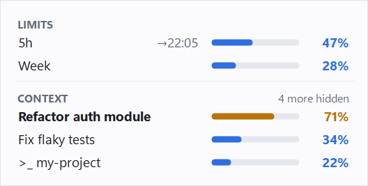

# ctxtray

Always-visible context and rate-limit readout for Claude Code on Windows.

[日本語版 README](README.ja.md)

Claude Desktop already shows your context usage and rate limits — but only after you
move the mouse to the indicator and click it. That breaks your train of thought.
`ctxtray` keeps the same numbers on screen all the time: a small always-on-top panel
plus bars drawn into the notification-area icon.

<picture>
  <source media="(prefers-color-scheme: dark)" srcset="docs/images/ctxtray-hud-en-dark.png">
  
</picture>

<sub>Sample data. Generated with `ctxtray --hud-preview`.</sub>

> **Unofficial.** This project is not affiliated with, endorsed by, or supported by Anthropic.
> Claude is a trademark of Anthropic, PBC.

## What it does

- **Context usage per session** — every open Claude Desktop Code tab. Sessions you have not
  used for a while (24 hours by default) are hidden.
- **5-hour and weekly rate limits**, plus the 5-hour reset time.
- **Notifications** when any of those crosses a threshold you set.

Claude Code sessions started from a terminal or VS Code are also listed, marked `>_`, when
Claude Code registers them as running processes. **That path has not been tested yet**
(the development machine only runs Claude Code inside Claude Desktop), so treat it as
experimental.

It only shows numbers it can back up. Estimates that could not be verified — turns left
until compaction, the weekly reset day — are deliberately left out.

## Install

1. Download `ctxtray-<version>-win-x64.zip` from [Releases](../../releases) and extract it.
2. Move `ctxtray.exe` to a folder you will keep, for example `%LOCALAPPDATA%\Programs\ctxtray\`.
   The sign-in shortcut (step 4) points at this location.
3. Run it. There is no installer and no runtime to install.
4. Right-click the tray icon → **Start at sign-in** if you want it to run every time you sign in.

Requirements: Windows 10 version 1903 or later, or Windows 11.
(.NET Framework 4.8 is part of the OS on those versions.)

The binary is not code-signed, so SmartScreen will warn on first run:
**More info → Run anyway**. You can check the download against the `.sha256` file next to it
on the release page. If you would rather not trust a prebuilt binary,
[build it yourself](#building).

## Using it

| | |
|---|---|
| `Ctrl+Alt+C` | show / hide the panel (configurable) |
| drag | move the panel |
| double-click the tray icon | show / hide the panel |
| right-click the tray icon | show / hide panel, start at sign-in, settings, refresh now, open config file, uptime, exit |

A session name in grey means its Claude Code process is not running right now
(for example, a tab that has been idle).

### The tray icon

The tray icon shows amounts as bars, not numbers — hover over it for the exact values.
Each value has its own colour (context blue, 5-hour green, weekly violet), and a value
that crosses a threshold turns amber, then red. Two arrangements, switchable in settings:

- **One combined icon** (default) — one horizontal bar per value, top to bottom:
  context, 5-hour, weekly.
- **One icon per value** — a separate icon for each value, with a label above its bar:
  letters (`C`, `5h`, `W`) or symbols (speech bubble, clock, calendar).
  If any of the icons land in the hidden overflow, drag them onto the taskbar once.

You choose which values to show, and the choice applies to both arrangements.

Where an icon shows context, it uses the session **closest to compaction** — chosen by
how close it is to its own compaction point, not by raw percentage, because models have
different context windows. Hidden sessions are not considered.

### Reading the rate limits

Claude Desktop samples your usage every 5–15 minutes and only while you are using it.
While you are working, the number shown can therefore trail your real usage: measured
growth reaches 2.8 %/min, so a 7-minute-old sample can understate the 5-hour window by
~20 points. `ctxtray --json` reports this as `"freshness": "behind"`.

**Greyed out means "for reference only"** — Claude Desktop is not running, or nothing has
been sampled for over 24 hours.

### Reset times

The 5-hour reset is derived from the sample history. Because samples are 5–15 minutes
apart, the estimate can be early by up to one sampling interval; when it was checked
against an actual reset, it was one minute off.

The weekly reset is **not recorded anywhere**. ctxtray can narrow it down to a weekday
from the history (`ctxtray --verify-weekly` shows the derivation), but that estimate is
not precise enough to trust, so it is not shown in the panel or the tooltip.

## Configuration

Tray menu → **Settings…** opens a dialog with four tabs (panel, tray icon, thresholds and
alerts, general). Everything is stored in `%LOCALAPPDATA%\ctxtray\config.json`; you can
also edit that file directly — **save it and changes apply immediately**, no restart.
If the file cannot be read while ctxtray is running, the previous settings stay in effect
until you fix it.

Comments (`//` and `/* */`) are accepted, as in the example below, but they are not kept:
ctxtray rewrites the file when you press OK in the dialog or move the panel.

Thresholds are defined **once** and drive the panel colours, the tray icon colour, and the
notifications together. There is no separate set of numbers for each.

```jsonc
{
  "thresholds": {
    // Context is expressed as progress toward the compaction point, not as a
    // raw percentage of the window — the compaction point is meant to be
    // calibrated from observation, and a fixed "85% = red" would turn red
    // *after* compaction if the real point turned out to be 80%.
    "context":  { "warn": 0.75, "danger": 0.90 },
    "fiveHour": { "warn": 80,   "danger": 95 },
    "weekly":   { "warn": 80,   "danger": 95 }
  },
  "notify": {
    "enabled": { "context": true, "fiveHour": true, "weekly": true },
    // After an alert, the value has to fall this many points below the
    // threshold before crossing it again alerts again.
    "hysteresisPts": 10,
    // Minimum time between alerts for one value. A rise to a higher level
    // than the last alert (warn -> danger) is reported straight away.
    "minRepeatMinutes": 30
  },
  "tray": {
    "mode": "single",            // "single" = one combined icon, "multi" = one per value
    "label": "letters",          // multi only: "letters" | "glyphs"
    "values": ["context", "fiveHour", "weekly"]
  },
  "display": {
    "theme": "auto",             // "light" | "dark"
    "textSize": "normal",        // "small" | "large" | "xlarge"
    "hudWidth": 352,             // panel width at normal text size
    "showRateLimits": true,
    "showSessions": true,
    "hideIdleSessions": true,
    "idleHours": 24,
    "showBar": true,
    "showTokens": false,         // e.g. 284k/1M
    "showResets": "auto",        // "always" | "auto" | "never" (5-hour reset time)
    "opacity": 0.9,
    "clickThrough": false,
    "showAtStartup": true
  },
  "language": "auto",            // "ja" | "en"
  // Context window for models ctxtray does not know yet (tokens).
  // Entries here take precedence over the built-in table.
  "modelLimits": { "claude-example-6": 1000000 }
}
```

`showResets: "auto"` (the default) only shows the 5-hour reset time during the last
30 minutes. Always-on, it just adds noise for the other four and a half hours.

## Command line

```
ctxtray                     run resident (tray + panel)
ctxtray --status            print the current state as a table
ctxtray --json              print the current state as JSON
ctxtray --no-external       only Claude Desktop tabs
ctxtray --include-archived  include closed tabs
ctxtray --verify-weekly     show how the weekly reset estimate was derived
ctxtray --icon-preview DIR  write a PNG sheet of every tray icon style to DIR
ctxtray --hud-preview DIR   write PNGs of the panel, filled with made-up data, to DIR
```

`--status` and `--json` list every session, including the ones the panel hides.

`ctxtray.exe` is a GUI program, so a shell does not wait for it and `>` redirection does
not capture its output. **Use a pipe** when scripting (PowerShell):

```powershell
ctxtray --json | ConvertFrom-Json
ctxtray --json | Out-File state.json
```

When the output goes to a pipe or a file, non-ASCII characters in the JSON are written as
`\uXXXX` escapes, so it reads correctly whatever code page the receiving side uses.

## What it reads, what it writes, and what it does not do

Everything it reads is a **plain-text file that Claude Desktop or Claude Code wrote itself**,
opened read-only. Details in [docs/how-it-works.md](docs/how-it-works.md).

| Source | Used for |
|---|---|
| `plan-usage-history.json` | 5-hour and weekly percentages |
| `claude-code-sessions/**/local_*.json` | which tabs are open, and their model and working directory |
| `~/.claude/projects/**/*.jsonl` | token counts from the `usage` field |
| `~/.claude/sessions/<pid>.json` | which Claude Code processes are actually running |

It writes only its own files:

- `%LOCALAPPDATA%\ctxtray\config.json` — your settings (plus `config.json.bak` if an
  unreadable file had to be set aside)
- `ctxtray.lnk` in your Startup folder — only while **Start at sign-in** is on

**ctxtray does not:**

- modify Claude Desktop in any way — no `app.asar` patching, no repacking, no injected
  preload scripts, no Electron fuse changes
- decompile or analyse Claude Desktop's code
- call any Anthropic API, documented or otherwise
- read, decrypt, or use stored OAuth tokens or session cookies
- read your conversations — only token counts, timestamps, and model names
- talk to the network at all, including update checks
- touch your `~/.claude/settings.json` (no hooks, no statusLine)

## Uninstall

1. Right-click the tray icon and turn **Start at sign-in** off (or delete `ctxtray.lnk`
   from the folder that opens with `shell:startup`).
2. Right-click the tray icon → **Exit**.
3. Delete `ctxtray.exe`.
4. Delete the `%LOCALAPPDATA%\ctxtray` folder.

## Limitations

- **These file formats are internal to Claude.** They can change in any update. ctxtray
  degrades to "unknown" instead of crashing or guessing, but a future release may need a fix.
- **Context is one turn behind.** Token counts are written when a response completes.
- **The compaction point is a placeholder (0.92).** Calibrating it from observed compactions
  is designed but not implemented yet. The context colours and notifications depend on it.
- **Unknown models show no percentage.** A wrong denominator is worse than an honest blank;
  add the model to `modelLimits` to fix it.
- **Terminal and VS Code sessions are untested** (see [What it does](#what-it-does)).
- Notifications use balloon tips, so they do not persist in the Action Center and are
  suppressed by Focus Assist.

## Building

Requires a .NET SDK (any version that can target `net48`; the reference assemblies are
downloaded from NuGet on the first build).

```
dotnet build src/CtxTray/CtxTray.csproj -c Release
```

Output: `src/CtxTray/bin/Release/ctxtray.exe`. The exe runs on its own; nothing else from
that folder needs to be copied.

Tests for the parsing and alerting logic live in `tests/CtxTray.Tests` (a plain console
program, no test framework). It prints the results and exits with 1 if anything failed:

```
dotnet build tests/CtxTray.Tests/CtxTray.Tests.csproj -c Release
tests/CtxTray.Tests/bin/Release/ctxtray-tests.exe
```

## License

MIT — see [LICENSE](LICENSE).
