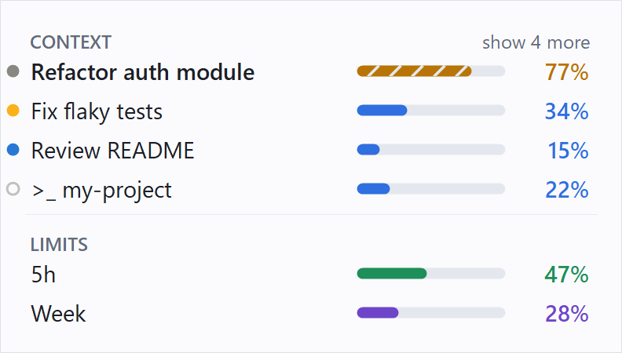
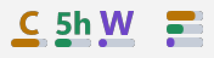

# ctxtray

Always-visible context and rate-limit readout for Claude Code on Windows.

[日本語版 README](README.ja.md)

Claude Desktop already shows your context usage and rate limits — but only after you
move the mouse to the indicator and click it. That breaks your train of thought.
`ctxtray` keeps the same numbers on screen all the time: a small always-on-top panel
plus bars drawn into the tray icon.

<picture>
  <source media="(prefers-color-scheme: dark)" srcset="docs/images/ctxtray-hud-en-dark.png">
  
</picture>

<picture>
  <source media="(prefers-color-scheme: dark)" srcset="docs/images/ctxtray-tray-dark.png">
  
</picture>

The tray icon can show one icon per value (left) or one combined icon (right).

<sub>Sample data. Generated with `ctxtray --hud-preview` and `ctxtray --icon-preview`.</sub>

> **Unofficial.** This project is not affiliated with, endorsed by, or supported by Anthropic.
> Claude is a trademark of Anthropic, PBC.

## What it does

- **Context usage per session** — Claude Desktop Code tabs, and Claude Code running in a
  terminal or VS Code.
- **5-hour and weekly rate limits**, plus the 5-hour reset time (estimated from the sample history).
- **Notifications** when a value crosses a threshold you set (for each value, you choose
  whether warn, danger, or both notify).

## What it does not do

ctxtray reads files that Claude Desktop and Claude Code wrote themselves, opened read-only
([listed below](#what-it-reads-and-the-network)).

- It does not modify Claude Desktop (no `app.asar` patching, no injected scripts, no Electron
  fuse changes), and does not decompile or analyse its code.
- It does not call any Anthropic API, documented or otherwise, and does not read stored sign-in
  data (OAuth tokens or session cookies).
- From the conversation logs it uses only token counts, timestamps, model names, and effort.
  It does not show, store, or send what was said.
- **By default it makes no network connections at all.** Only two settings can turn one on,
  and neither sends sign-in data or anything about your conversations
  ([below](#what-it-reads-and-the-network)).
- It does not install updates by itself.
- It does not change your `~/.claude/settings.json` (no hooks, no statusLine).

## Install

1. Download `ctxtray-<version>-win-x64.zip` from [Releases](../../releases) and extract it.
2. Move `ctxtray.exe` to a folder you will keep, for example `%LOCALAPPDATA%\Programs\ctxtray\`.
   Avoid folders synced by OneDrive (Desktop and Documents often are) and folders you create
   directly under `C:\`. Other devices or other users can change the files there, and a
   replaced exe would then run every time you sign in.
3. Run `ctxtray.exe`. There is no installer and no runtime to install.
   The binary is not code-signed, so SmartScreen warns on first run: select **More info**, then **Run anyway**.
4. To start it every time you sign in, right-click the tray icon and select **Start at sign-in**
   (the same switch is in **Settings > General**).
   If you move `ctxtray.exe` later, start it once from the new place and turn **Start at sign-in** on again.

Requirements: Windows 10 version 1903 or later, or Windows 11 (.NET Framework 4.8 is part of the OS on those versions).
It has been checked on Windows 11 (25H2, 150% display scale) with the Claude Code 2.1.284 that
Claude Desktop bundles. It has not been checked on Windows 10.

To check that a download is genuine, see [Verifying the download](docs/verify.md).
If you would rather not trust a prebuilt binary, [build it yourself](#building).

### Hearing about new versions

Turn on **Check for new versions** in **Settings > General**: once a day ctxtray checks GitHub for
the latest version number and notifies you when there is a newer one (off by default; you replace
the exe yourself). If you would rather leave it off, use **Watch > Custom > Releases** at the top of
this repository to get notified by GitHub.

## Using it

| Action | Result |
|---|---|
| `Ctrl+Alt+C` | show / hide the panel (the shortcut can be changed in Settings) |
| drag | move the panel |
| hover over a row | details: the full name, the model and effort, token counts, how much is left before auto-compaction, and when the value was recorded |
| click the tray icon | show / hide the panel |
| right-click the tray icon or the panel | menu (settings, pass clicks through, start at sign-in, exit, and more) |

- The **dot** to the left of a session name means the same as the dot in Claude Desktop's
  sidebar: amber is waiting for your approval or answer, or an unread reply that needs you; blue
  is an unread reply; grey is working; and a ring means it has finished or is not running. The
  row details say which kind of amber it is. Settings can also highlight the rows that need you.
- A session name in **grey** means its Claude Code process is not running. Grey sessions are
  left out of the tray icon and the notifications.
- When the limits heading says **for reference**, Claude Desktop is not running or nothing has
  been recorded for over 24 hours, so the last recorded values are shown.
- When it says **recorded 40 min ago** and the values are grey, Claude Desktop has stopped recording
  while you work. Restarting Claude Desktop may fix it.
- The panel is **kept out of screen sharing and screenshots** (you still see it on your own screen),
  so session names do not show up in a shared screen in a meeting. It relies on a Windows feature,
  so it cannot promise that every way of capturing the screen leaves it out. Before Windows 10
  version 2004 the panel shows up as an empty box instead. This can be turned off in Settings.

What to show, the thresholds where colours change, notifications, and the tray icon's layout
are all in **Settings…** on the tray menu.

- More about using it (the two tray icon layouts, reading the rate limits, notifications,
  auto-compaction, model and effort, and more): [docs/usage.md](docs/usage.md)
- Every config file key, and the command line: [docs/configuration.md](docs/configuration.md)
- How it works: [docs/how-it-works.md](docs/how-it-works.md)

## What it reads, and the network

| Source | Used for |
|---|---|
| `plan-usage-history.json` | 5-hour and weekly percentages |
| `claude-code-sessions/**/local_*.json` | which tabs are open, their model and working directory, when each tab was last opened, and how the last reply was classified (complete / needs action) |
| `~/.claude/projects/**/*.jsonl` | token counts from the `usage` field, and the model, effort and time of that response |
| `~/.claude/sessions/<pid>.json` | which Claude Code processes are running, and what each is doing (working, waiting for approval, and so on) |

It also asks Windows:

- whether Claude Desktop and Claude Code processes are running (process names, the executables'
  product names, and start times)
- whether a full-screen app is in use, and which program owns the window in front (so that the
  panel hides over full-screen apps but not over Claude Desktop)
- whether Windows uses a light or dark theme

It writes only its own files in `%LOCALAPPDATA%\ctxtray\` (settings and the like), and a shortcut
in your Startup folder while **Start at sign-in** is on
([full list](docs/configuration.md#files-it-writes)).

It connects to the network only if you turn on one of these:

- **Look up unknown models in the official docs** (Settings > Models): when ctxtray meets a model it
  does not know, it reads that model's public documentation page on `platform.claude.com`.
  A model that is not found is checked again after 24 hours.
- **Check for new versions** (Settings > General): once a day it reads the latest release's version
  number from GitHub's public API. After a failed check it tries again an hour later.

## Limitations

- **These file formats are internal to Claude.** They can change in any update. When a source
  can no longer be read, ctxtray shows "unknown" instead of guessing, but a fix to ctxtray is needed.
- **Context is one turn behind.** Token counts are written when a response completes.
- **Rate limits can trail your real usage.** Claude Desktop records them every 5–15 minutes,
  and only while you are using it. Nothing is recorded while Claude Desktop is closed.
- **A model ctxtray does not know shows `?%` instead of a percentage.** Pick its context window
  in **Settings > Models**.
- **ctxtray does not read Claude Code's settings.** If you changed where auto-compaction happens
  with `/autocompact`, enter the same value under **Auto-compaction** in **Settings > General**
  ([details](docs/usage.md#where-auto-compaction-happens)).
- Notifications do not stay in the Windows notification centre (they use the older balloon tips).
- The panel cannot be read by a screen reader. The same values are in the tray icon's tooltip
  and in `ctxtray --status`.

## Support and versions

- This is a personal project. Bug reports and requests are welcome in [Issues](../../issues)
  (English or Japanese). Replies may take a while.
- If you paste the output of `ctxtray --json` into a report, remove the session names (`title`),
  folder paths (`cwd`), and the paths that contain your user name (`paths`, `transcript`) first.
- Throughout 1.x, the meaning of config file keys and command-line options will not change;
  a change like that would come as 2.0.0. The output of `--json` is for looking into problems
  and its fields may change (it is not covered by this promise). Fixes for changes in Claude's
  own file formats are made within 1.x.
- Changes are listed in [Releases](../../releases).

## Uninstall

1. Right-click the tray icon and turn **Start at sign-in** off.
2. Right-click the tray icon and select **Exit**.
3. Delete `ctxtray.exe` and the `%LOCALAPPDATA%\ctxtray` folder.

## Building

Requires a .NET SDK (any version that can target `net48`; the reference assemblies are
downloaded from NuGet on the first build).

```
dotnet build src/CtxTray/CtxTray.csproj -c Release
```

Output: `src/CtxTray/bin/Release/ctxtray.exe`. The exe runs on its own.
Run the tests like this (the program exits with 1 if anything failed):

```
dotnet build tests/CtxTray.Tests/CtxTray.Tests.csproj -c Release
tests/CtxTray.Tests/bin/Release/ctxtray-tests.exe
```

## License

MIT — see [LICENSE](LICENSE).
